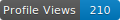

  <h1>Hello there, Ram Narayan Balaji Here 👋</h1>

  

  
  

  

## 📊 GitHub Stats

  

  

## 🏆 GitHub Trophies

  

## 📈 Contribution Graph

  <a href="https://github.com/yan-3005">
    <picture>
      <source media="(prefers-color-scheme: dark)" srcset="https://raw.githubusercontent.com/yan-3005/yan-3005/main/dist/github-contribution-grid-snake-dark.svg" />
      <source media="(prefers-color-scheme: light)" srcset="https://raw.githubusercontent.com/yan-3005/yan-3005/main/dist/github-contribution-grid-snake.svg" />
      
    </picture>
  </a>

## 👨‍💻 Coding Activity

  

## ⌨️ Software Development Engineer 2 at Oracle, Backend Developer 
-  Aspiring to be full fledged Backend Developer with DevOps Capabilities
-  Focuses on Skills, Always Learning new tech stacks and focused on improving my career

  
  
  

👐 Looking to Collaborate with People on Backend Tech Stacks Related to Java and Spring Boot
    
### 📚 Tech Stacks
  
#### 🥇 Experienced in 

  
  
  
  
  
  

#### 🥈 Familiar with 

  
  
  
  
  
  
  

#### 🥉 Basic Knowledge in

  
  
  
  
  

    
### 🍾 Current Interest
- Open Source Contribution
- DevOps Tech Stacks
    
### 😮 Talks About
- Backend, Java and DevOps
- Anime, Cricket
    
### 🎥 Ask me about
- Anime
- Cricket
- Backend
    
### 🤝 Connect with me

  

### 🥊 Fun Facts
- Learning Kickboxing
- Can watch anime for 10 hours straight
- Believes that coffee is the secret to good code
- Cricket enthusiast who never misses a match

---

  <table>
    <tr>
      <td>
        

          <h3><i>"The only way to do great work is to love what you do. If you haven't found it yet, keep looking. Don't settle."</i></h3>
          
- Steve Jobs

        

      </td>
    </tr>
    <tr>
      <td>
        

          <h3><i>"First, solve the problem. Then, write the code."</i></h3>
          
- John Johnson

        

      </td>
    </tr>
    <tr>
      <td>
        

          <h3><i>"Code is poetry written for humans to read and incidentally computers to execute."</i></h3>
          
- Ward Cunningham

        

      </td>
    </tr>
  </table>

  
    
  
  
  

  <h3>Thanks for visiting my profile! Have an amazing day! 🙏</h3>
  
<i>Your next step is just the beginning of a whole new journey.</i>

## 📊 My Language Stats
<!-- START_SECTION:lang-stats -->
## Language Distribution

Java       ████████████████████████░░░░░░░░░░░░░░░░░░░░░░  68.7%
Python     ███████░░░░░░░░░░░░░░░░░░░░░░░░░░░░░░░░░░░░░░  14.3%
JavaScript ████░░░░░░░░░░░░░░░░░░░░░░░░░░░░░░░░░░░░░░░░░   8.1%
Shell      ██░░░░░░░░░░░░░░░░░░░░░░░░░░░░░░░░░░░░░░░░░░░   4.2%
C++        █░░░░░░░░░░░░░░░░░░░░░░░░░░░░░░░░░░░░░░░░░░░░   2.3%
HTML       █░░░░░░░░░░░░░░░░░░░░░░░░░░░░░░░░░░░░░░░░░░░░   1.8%
CSS        ░░░░░░░░░░░░░░░░░░░░░░░░░░░░░░░░░░░░░░░░░░░░░   0.4%
C          ░░░░░░░░░░░░░░░░░░░░░░░░░░░░░░░░░░░░░░░░░░░░░   0.2%
<!-- END_SECTION:lang-stats -->

## ⏱ Weekly Development Focus

  
  
  
  

## 🔄 Recent Activity
<!--START_SECTION:activity-->
1. ❌ Labeled PR [#24157](undefined) in [open-metadata/OpenMetadata](https://github.com/open-metadata/OpenMetadata)
2. ❌ Labeled PR [#24157](undefined) in [open-metadata/OpenMetadata](https://github.com/open-metadata/OpenMetadata)
3. ❌ Labeled PR [#24157](undefined) in [open-metadata/OpenMetadata](https://github.com/open-metadata/OpenMetadata)
4. 💪 Opened PR [#24157](undefined) in [open-metadata/OpenMetadata](https://github.com/open-metadata/OpenMetadata)
5. ❌ Assigned PR [#24157](undefined) in [open-metadata/OpenMetadata](https://github.com/open-metadata/OpenMetadata)
<!--END_SECTION:activity-->

<!--
**yan-3005/yan-3005** is a ✨ _special_ ✨ repository because its `README.md` (this file) appears on your GitHub profile.
-->